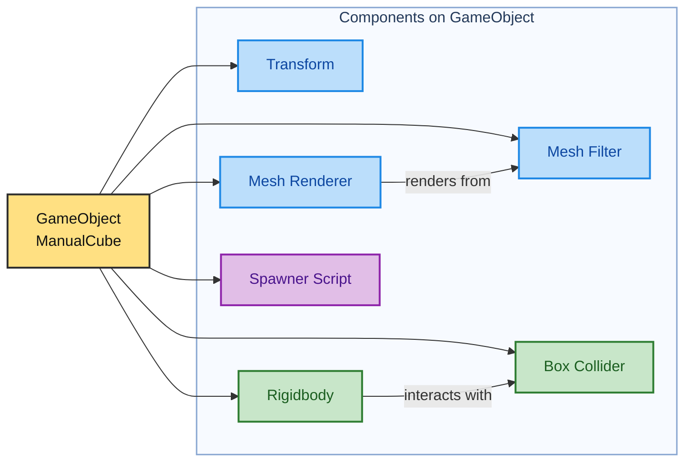

# บทที่ 01
## พื้นฐาน Game Engine และการเริ่มต้นใช้ Unity
Game Design and Development @ Faculty of Science, Silpakorn University

---
## แผนการสอน (3 ชั่วโมง)
1. ความหมายและบทบาทของ `Game Engine`
2. โครงสร้าง `Unity Editor` และ workflow พื้นฐาน
3. แนวคิด `GameObject` และ `Component-based Architecture`
4. ปฏิบัติการสร้าง `Cube` จาก `Empty GameObject`
5. เขียน `Script` เบื้องต้นเพื่อ `Instantiate` วัตถุแบบวนลูป

---
## กรอบแนวคิด: Engine, Framework, Library
- `Library` ให้ฟังก์ชันเฉพาะด้าน และให้ผู้พัฒนาเป็นผู้ควบคุม flow หลัก
- `Framework` กำหนดโครงสร้างการทำงานระดับหนึ่ง และเรียกใช้โค้ดของผู้พัฒนา
- `Game Engine` รวม runtime subsystem หลายด้านภายใต้ game loop เดียว พร้อม editor และ tooling สำหรับ production

ข้อสังเกต: ในงานอุตสาหกรรมจริง เกมมักไม่ได้ใช้ engine ล้วน ๆ แต่ใช้ engine ร่วมกับ library และ framework เสริมเฉพาะงาน

---
## คำศัพท์สำคัญ (Key Terms) ที่ต้องแม่น
- `Game Loop`: วงจร update และ render ที่รันต่อเนื่องทุก frame
- `Frame`: ภาพหนึ่งจังหวะของการแสดงผล
- `Tick`, `Fixed Timestep`: รอบคำนวณเชิงฟิสิกส์ที่คงที่
- `Entity`: หน่วยวัตถุในโลกเกม (ใน Unity มักเทียบกับ `GameObject`)
- `Component`: หน่วยพฤติกรรม/ข้อมูลที่ประกอบบน entity
- `Prefab`: แม่แบบ object ที่นำไปสร้างซ้ำได้

---
## ภาพอ้างอิงจาก Unity Manual และจุดสังเกต
ภาพรวมหน้าต่างใน `Unity Editor`:

จุดสังเกตสำคัญ:
- โครงสร้าง editor แยกมุมมองแก้ไข (`Scene`) กับมุมมองผลลัพธ์ (`Game`) ชัดเจน
- `Hierarchy` + `Inspector` คือแกนหลักของการทำงานแบบ `Component-based`
- `Project` + `Console` เชื่อม workflow ระหว่าง asset pipeline และ debugging

---
## คำถามนำคิดก่อนเข้าสู่ภาคปฏิบัติ
1. ถ้าไม่มี `Game Engine` เราต้องเขียน subsystem ใดเองบ้าง?
2. เพราะเหตุใดการแยก `Rendering`, `Physics`, `Collision` จึงช่วยการทดสอบ?
3. ในระบบที่ขยายต่อได้ง่าย ควรเลือก `composition` หรือ `inheritance` เป็นหลัก เพราะอะไร?
4. หากต้องสร้าง object 500 ชิ้น ควรใช้วิธี manual placement หรือ `Instantiate` แบบเป็นระบบ?

---
## ผลลัพธ์การเรียนรู้ของคาบนี้
เมื่อจบคาบ นักศึกษาควรสามารถ:
- อธิบายความหมายของ `Game Engine` ได้อย่างเป็นระบบ
- ระบุ module หลักของ engine ที่ใช้ในอุตสาหกรรมเกม
- ใช้งานหน้าต่างหลักของ `Unity Editor` ได้ถูกต้อง
- ออกแบบวัตถุด้วยแนวคิด `Component` แทนการยัด logic ไว้จุดเดียว
- เขียน `C# Script` สำหรับสร้างวัตถุหลายชิ้นด้วย `for loop`

---
## มาตรฐานตัวอย่างโค้ดของรายวิชา (SOLID)
ตั้งแต่บทนี้เป็นต้นไป ตัวอย่างโค้ดทั้งหมดในรายวิชาใช้หลัก `SOLID` เป็น baseline:
- หนึ่ง script หนึ่งหน้าที่หลัก (`Single Responsibility`)
- เพิ่มความสามารถด้วย component ใหม่ มากกว่าแก้ script เดิม (`Open/Closed`)
- พึ่งพา abstraction และ contract เมื่อระบบเริ่มซับซ้อน (`Dependency Inversion`)

ข้อกำหนดนี้ใช้กับทั้งตัวอย่างในสไลด์ งานปฏิบัติ และโครงงานย่อย

---
## ความหมายของ Game Engine
`Game Engine` คือชุดระบบซอฟต์แวร์ที่จัดเตรียมกลไกหลักสำหรับพัฒนาเกม โดยลดภาระการเขียนระบบระดับล่างซ้ำ ๆ เช่นการเรนเดอร์ภาพ การคำนวณฟิสิกส์ และการจัดการทรัพยากร ทำให้ผู้พัฒนามุ่งไปที่การออกแบบ gameplay และประสบการณ์ผู้เล่นได้มากขึ้น

---
## เหตุผลที่อุตสาหกรรมเลือกใช้ Game Engine
- ลดเวลา `prototype` และเพิ่มความเร็วในการ iterate
- มี `tooling` สำหรับทีมข้ามสายงาน (programmer, artist, designer)
- รองรับการพัฒนาแบบหลายแพลตฟอร์ม (cross-platform)
- มี ecosystem ของ package, plugin และ community support

---
## ภาพรวม Module หลักใน Engine
module สำคัญที่พบได้ใน engine สมัยใหม่ ได้แก่:
- `Rendering`
- `Physics`
- `Input`
- `Audio`
- `Animation`
- `Scripting`
- `Scene Management`
- `UI System`
- `Asset Pipeline`

---
## หลักการทำงานร่วมกันของ Module
ในเชิงสถาปัตยกรรม แต่ละ module มีหน้าที่เฉพาะ แต่เชื่อมกันผ่านข้อมูลและ event ภายใต้ game loop เดียวกัน การแยกความรับผิดชอบ (separation of concerns) ลักษณะนี้ช่วยให้ระบบขยายได้ง่ายขึ้น ทดสอบได้ง่ายขึ้น และลดผลกระทบแบบลูกโซ่เมื่อมีการแก้ไขโค้ด

---
## แนะนำ Unity Editor
`Unity Editor` เป็นสภาพแวดล้อมสำหรับสร้าง แก้ไข และทดสอบเกมแบบ interactive โดยหน้าต่างหลักที่ต้องใช้ประจำมีดังนี้:
- `Scene`
- `Game`
- `Hierarchy`
- `Inspector`
- `Project`
- `Console`

---
## โครงสร้างหน้าต่างและ Layout
หลักการใช้งานเบื้องต้น:
- `Scene` ใช้จัดวางและแก้ไข object
- `Game` ใช้ดูผลลัพธ์ขณะรัน
- `Hierarchy` ใช้บริหารโครงสร้าง object ใน scene
- `Inspector` ใช้แก้ค่า `Component`
- `Project` ใช้จัดการ asset และ script
- `Console` ใช้วิเคราะห์ warning/error

---
## โครงสร้างไฟล์โครงการใน Unity
โฟลเดอร์สำคัญที่ต้องเข้าใจ:
- `Assets/` เก็บ source content ทั้งหมดของโปรเจกต์
- `Packages/` เก็บ dependency ของ package
- `ProjectSettings/` เก็บค่าคอนฟิกระดับโปรเจกต์

ข้อเสนอเชิงวิชาการ: จัดโครงสร้างไฟล์ตาม feature, domain, และ pipeline ตั้งแต่ต้น จะลด technical debt ระยะยาว

---
## แนวคิด GameObject และ Component
ใน Unity, `GameObject` ทำหน้าที่เป็น container ส่วนพฤติกรรมถูกกำหนดโดย `Component` ที่เพิ่มเข้าไปภายหลัง แนวคิดนี้สอดคล้องกับหลัก `composition over inheritance` ซึ่งยืดหยุ่นกว่าการใช้ class hierarchy ที่ลึกเกินไป

---
## Diagram: GameObject และ Component

---
## Design Pattern ที่ Unity เน้นใช้
Unity สนับสนุนการประกอบความสามารถด้วยการเพิ่ม, ถอด `Component` บน `GameObject` ทำให้ระบบย่อยเช่น `Renderer`, `Collider`, `Rigidbody` สามารถทำงานอย่างเป็นอิสระและประสานกันผ่าน object เดียว

---
## แนวทางออกแบบ Component ด้วย SOLID
การประยุกต์ `SOLID` ในบริบท Unity:
- `S` (`Single Responsibility`): หนึ่ง component ต่อหนึ่งบทบาทหลัก
- `O` (`Open/Closed`): ต่อยอดด้วย component ใหม่ แทนแก้ของเดิมบ่อยครั้ง
- `L` (`Liskov Substitution`): พฤติกรรมที่สืบทอดต้องแทนกันได้จริง
- `I` (`Interface Segregation`): แยก interface ตามหน้าที่ ไม่บังคับ implement เกินจำเป็น
- `D` (`Dependency Inversion`): พึ่ง abstraction แทน concrete implementation

---
## Lab 1: สร้าง Cube จาก Empty (แนวคิด)
[mode:activity]
[Tips] เริ่มจาก `Empty GameObject` ก่อนเสมอ เพื่อให้เห็นชัดว่า behavior มาจากการประกอบ `Component` ไม่ได้มาจาก object สำเร็จรูป

เป้าหมายของกิจกรรมนี้คือพิสูจน์ว่า object ที่มองเห็นและโต้ตอบได้ในเกม ไม่ได้เกิดจาก class เดียว แต่เกิดจากการประกอบหลาย component ที่รับผิดชอบคนละมิติ

---
## Lab 1: ขั้นตอนปฏิบัติ
[mode:activity]
[Tips] หลังแต่ละขั้นตอน ให้หยุดตรวจใน `Inspector` ว่า component ถูกเพิ่มครบและค่าถูกต้อง

1. สร้าง `Empty GameObject` ชื่อ `ManualCube`
2. เพิ่ม `Mesh Filter` และกำหนด mesh เป็น Cube
3. เพิ่ม `Mesh Renderer` เพื่อให้วัตถุแสดงผล
4. เพิ่ม `Box Collider` เพื่อรองรับการชน
5. เพิ่ม `Rigidbody` เพื่อให้เข้าสู่การจำลองฟิสิกส์

---
## การทดลองความเป็นอิสระของระบบ
ให้ปิด component ทีละตัวแล้วสังเกตผล:
- ปิด `Mesh Renderer` -> วัตถุไม่แสดงผล แต่ยังชนได้
- ปิด `Box Collider` -> ไม่มีการชน แต่ยังเห็นวัตถุ
- เอา `Rigidbody` ออก -> ไม่มีแรงโน้มถ่วง และไม่มีการเคลื่อนแบบฟิสิกส์

ข้อสรุป: `Rendering`, `Collision`, `Physics` เป็น subsystem ที่แยกกันจริง

---
## บทนำสู่ Script: การสร้างวัตถุซ้ำด้วย Loop
[Tips] มองหัวข้อนี้ในมุม production จริง: การสร้าง object จำนวนมากแบบอัตโนมัติคือพื้นฐานของระบบ spawn ในเกมหลายประเภท

แนวคิด `Instantiate` ร่วมกับ `for loop` เป็นพื้นฐานของการสร้างฉากแบบ procedural ระดับเริ่มต้น ช่วยให้เห็นศักยภาพการผลิต object จำนวนมากอย่างเป็นระบบ ไม่ต้องวางมือทีละชิ้น

---
## วงจรชีวิต Script เบื้องต้น: Start และ Update
- `Start()` ทำงาน 1 ครั้ง เมื่อ object ถูก initialize ก่อนเริ่มเล่นจริง
- `Update()` ทำงานทุก frame ตลอดเวลาที่ object active
- งานตั้งค่าเริ่มต้นควรอยู่ใน `Start()`
- งานที่ต้องตรวจทุกเฟรม เช่น input, animation state ควรอยู่ใน `Update()`

---
## ทำไม Frame Rate แต่ละเครื่องไม่เท่ากัน
- เครื่องแต่ละเครื่องมีพลังประมวลผลต่างกัน
- จำนวน object, effect, และ system ต่าง ๆ ในฉากมีผลต่อเวลาคำนวณต่อ frame
- เมื่อเวลาต่อ frame ไม่เท่ากัน `Update()` จึงถูกเรียกด้วยช่วงเวลาที่ไม่คงที่
- ถ้าเขียน logic แบบพึ่งจำนวน frame ตรง ๆ ความเร็วเกมจะเพี้ยนข้ามเครื่อง

---
## แนวคิด Delta Time
`Time.deltaTime` คือเวลาที่ผ่านไปจาก frame ก่อนหน้า (หน่วยวินาที)

หลักการสำคัญ:
- เคลื่อนที่, เปลี่ยนค่าแบบคูณ `deltaTime` เพื่อให้ independent จาก frame rate
- ตัวอย่าง: ความเร็ว 5 หน่วยต่อวินาที ควรเขียน `speed * Time.deltaTime`
- ผลลัพธ์: เกมให้ความรู้สึกใกล้เคียงกันทั้งเครื่องที่ FPS สูงและต่ำ

---
## ตัวอย่าง Start, Update และ Delta Time
<pre style="height: 70vh; overflow:auto;"><code class="language-csharp">using UnityEngine;

public class MoveWithDeltaTime : MonoBehaviour
{
    public float speed = 5f;

    void Start()
    {
        Debug.Log("Start called once");
    }

    void Update()
    {
        transform.position += Vector3.right * speed * Time.deltaTime;
    }
}
</code></pre>

---
## ตัวอย่าง C# Script สำหรับสาธิต
ตัวอย่างกำหนดกรอบโค้ดให้สูงคงที่ (เลื่อนได้ในกรอบ):

<pre style="height: 70vh; overflow:auto;"><code class="language-csharp">using UnityEngine;

public class CubeRainSpawner : MonoBehaviour
{
    public GameObject cubePrefab;
    public int count = 20;
    public float spacing = 1.25f;
    public float height = 10f;

    void Start()
    {
        for (int i = 0; i < count; i++)
        {
            Vector3 pos = transform.position + new Vector3(i * spacing, height, 0f);
            Instantiate(cubePrefab, pos, Quaternion.identity);
        }
    }
}
</code></pre>

---
## วิเคราะห์ Script เชิงหลักการ
[Tips] โฟกัสความหมายของ `public` กับ `Inspector` เพราะเป็นจุดที่เชื่อมระหว่าง code และ editor ได้ชัดที่สุดในคาบแรก

- ตัวแปร `public` ใช้เปิด parameter ให้ปรับใน `Inspector`
- `Start()` ทำงานครั้งเดียวเมื่อเริ่ม scene
- `for loop` ควบคุมจำนวน object ที่สร้าง
- `Instantiate(...)` สร้าง instance ใหม่จาก prefab
- การแยก parameter ช่วยให้ทดลองเชิงระบบได้ง่าย

---
## กิจกรรมในห้อง: Parameter Experiment
ให้นักศึกษาทดลองปรับค่าและบันทึกผล:
- เพิ่ม, ลด `count`
- ปรับ `spacing`
- ปรับ `height`
- ทดลองสุ่มตำแหน่ง spawn

วัตถุประสงค์: เชื่อมโยง parameter tuning กับพฤติกรรมที่เกิดขึ้นจริงใน simulation

---
## สรุปประจำคาบ
สาระสำคัญของบทที่ 01:
- เข้าใจบทบาทของ `Game Engine` ในมุมอุตสาหกรรม
- เห็นภาพการทำงานแบบ module-based ของ engine
- เข้าใจหัวใจของ Unity คือ `Component-based Design`
- เริ่มต้นเขียน script เพื่อสร้างพฤติกรรมอัตโนมัติ

---
## งานที่ต้องส่ง (Unity Lab 01)
[mode:activity]
[Tips] ตรวจงานตนเองก่อนส่งด้วย checklist สั้น ๆ เช่น Correct Setup, Correct Physics, Correct Script, ...

- คำอธิบายสั้น: `Game Engine` คืออะไร (ภาษาตนเอง)
- ภาพหน้าจอ `Unity Editor` พร้อมระบุชื่อหน้าต่างหลัก
- ภาพ/วิดีโอการสร้าง `Cube` จาก `Empty GameObject`
- ผลการรัน `CubeRainSpawner` (วัตถุตกด้วย `Rigidbody`)
- Reflection สั้น: สิ่งที่เรียนรู้และปัญหาที่พบ
