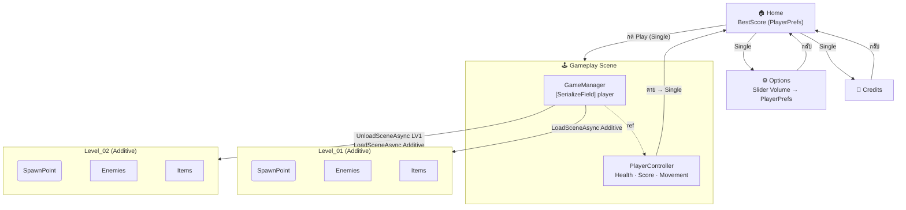
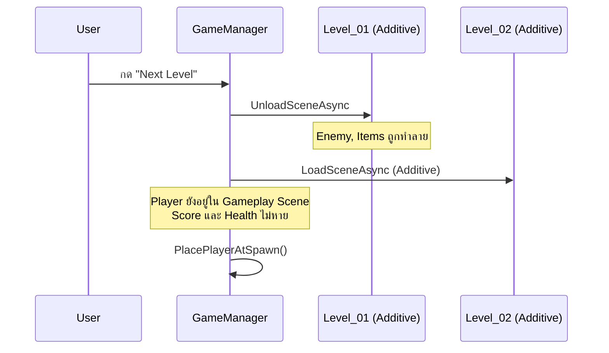
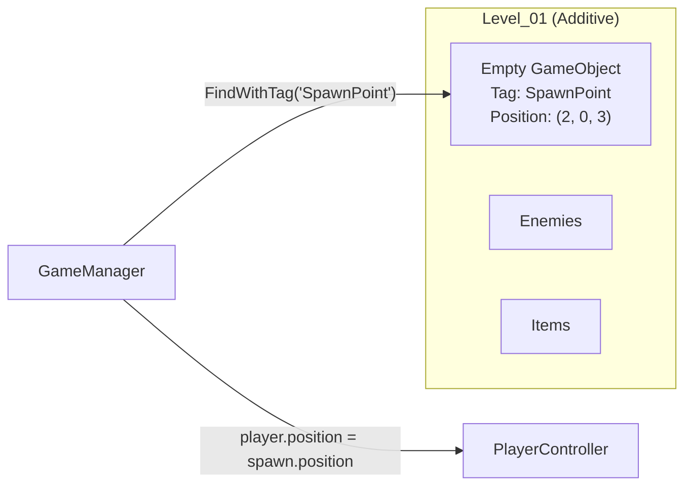
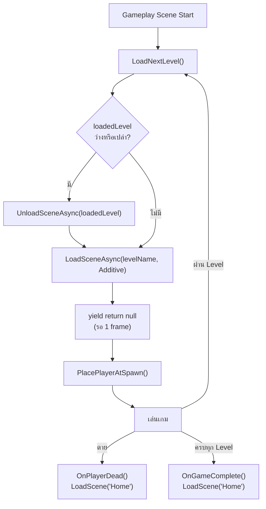
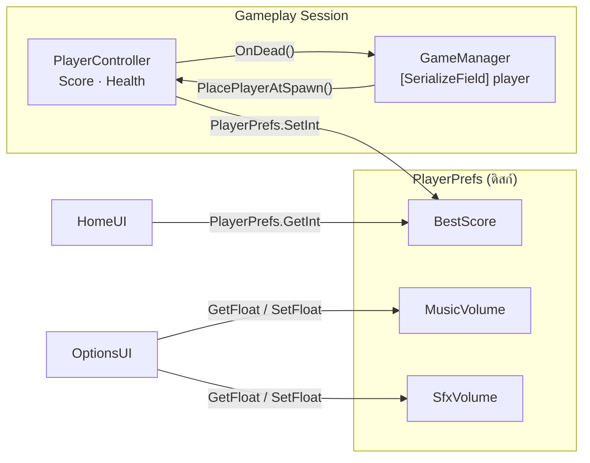

# บทที่ 04
## Scene Architecture — GameManager + Additive Level Loading
Game Design and Development @ Faculty of Science, Silpakorn University
<!-- style: |
section table {
  font-size: 0.78em;
}
-->

---
## เป้าหมายของบทนี้
- สร้าง `PlayerController` และ `EnemyController` แบบ self-contained
- เข้าใจความต่างของ **Single** และ **Additive** scene loading
- ให้ `GameManager` โหลด/Unload Level แบบ Additive ขณะที่ข้อมูลตัวละครยังอยู่
- บันทึกและโหลดข้อมูลข้าม session ด้วย **PlayerPrefs**

---
## ภาพรวม Architecture



[Tips] PlayerController อยู่ใน Gameplay Scene เสมอ — Level โหลดเข้า/ออกรอบ ๆ ตัวละคร

---
## Scene ในโปรเจกต์
| Scene | โหลดแบบ | มีอะไร |
|---|---|---|
| `Home` | Single | ปุ่ม Play, Options |
| `Options` | Single | Slider Volume → PlayerPrefs |
| `Gameplay` | Single | PlayerController + GameManager + UI |
| `Level_01` | **Additive** | SpawnPoint + Enemy + Items + Environment |
| `Level_02` | **Additive** | SpawnPoint + Enemy + Items + Environment |

---
# ส่วนที่ 1
## PlayerController & EnemyController

---
## PlayerController — ทุกอย่างเกี่ยวกับตัวละครอยู่ที่นี่
<pre style="height: 58vh; overflow:auto;"><code class="language-csharp">using UnityEngine;

[RequireComponent(typeof(Rigidbody))]
public class PlayerController : MonoBehaviour
{
    [Header("การเคลื่อนที่")]
    [SerializeField] private float speed = 5f;

    [Header("สถานะ")]
    [SerializeField] private int maxHealth = 3;
    private int health;

    public int  Score   { get; private set; }
    public int  Health  => health;
    public bool IsAlive => health > 0;

    private Rigidbody rb;

    private void Awake()
    {
        rb     = GetComponent<Rigidbody>();
        health = maxHealth;
    }

    private void FixedUpdate()
    {
        if (!IsAlive) return;
        float h = Input.GetAxis("Horizontal");
        float v = Input.GetAxis("Vertical");
        rb.MovePosition(rb.position + new Vector3(h, 0f, v) * speed * Time.fixedDeltaTime);
    }

    public void AddScore(int v) => Score += v;

    public void TakeDamage(int v)
    {
        if (!IsAlive) return;
        health -= v;
        if (health <= 0) OnDead();
    }

    private void OnDead()
    {
        // บันทึก best score ก่อนออกจากเกม
        int best = PlayerPrefs.GetInt("BestScore", 0);
        if (Score > best)
        {
            PlayerPrefs.SetInt("BestScore", Score);
            PlayerPrefs.Save();
        }

        FindObjectOfType<GameManager>()?.OnPlayerDead();
    }

    private void OnTriggerEnter(Collider other)
    {
        if (other.CompareTag("Coin"))
        {
            AddScore(10);
            other.gameObject.SetActive(false);
        }
        else if (other.CompareTag("Bomb"))
        {
            TakeDamage(1);
            other.gameObject.SetActive(false);
        }
    }
}
</code></pre>

---
## EnemyController — AI วิ่งตาม Player
<pre style="height: 58vh; overflow:auto;"><code class="language-csharp">using UnityEngine;

public class EnemyController : MonoBehaviour
{
    [Header("AI")]
    [SerializeField] private float speed         = 2f;
    [SerializeField] private float attackCooldown = 1f;

    [Header("สถานะ")]
    [SerializeField] private int damage = 1;
    [SerializeField] private int health = 3;

    private Transform player;
    private float     lastAttackTime;

    private void Start()
    {
        // ค้นหา Player ด้วย Tag
        var go = GameObject.FindWithTag("Player");
        if (go != null) player = go.transform;
    }

    private void Update()
    {
        if (player == null) return;
        var dir = (player.position - transform.position).normalized;
        transform.position += dir * speed * Time.deltaTime;
        transform.forward   = dir;
    }

    public void TakeDamage(int v)
    {
        health -= v;
        if (health <= 0) Destroy(gameObject);
    }

    private void OnTriggerEnter(Collider other)
    {
        if (Time.time - lastAttackTime < attackCooldown) return;

        var pc = other.GetComponent<PlayerController>();
        if (pc == null) return;

        lastAttackTime = Time.time;
        pc.TakeDamage(damage);
    }
}
</code></pre>

---
## Scene Setup เบื้องต้น (ทดสอบ 2 script นี้ก่อน)
**Player** — Capsule + Rigidbody (Freeze Rotation X, Z) + Capsule Collider
- ใส่ `PlayerController` | Tag: **"Player"**

**Enemy Prefab** — Cube + Capsule Collider (Is Trigger = **true**)
- ใส่ `EnemyController` | Tag: **"Enemy"**

**Coin Prefab** — Sphere + Sphere Collider (Is Trigger = **true**) | Tag: **"Coin"**

**Bomb Prefab** — Sphere + Sphere Collider (Is Trigger = **true**) | Tag: **"Bomb"**

กด Play ทดสอบว่า Player เดินได้ Enemy วิ่งตาม และเก็บ Coin/Bomb มีผลต่อ Health/Score

---
# ส่วนที่ 2
## Scene Management — Single vs Additive

---
## Single vs Additive
| | Single | Additive |
|---|---|---|
| เมื่อโหลด | **ทำลาย** Scene เก่าทั้งหมด | Scene เก่า**ยังอยู่** |
| ใช้สำหรับ | เปลี่ยนหน้าจอหลัก | โหลด Level เพิ่มใน Session |
| ผลต่อ Player | Player ถูกทำลาย (อยู่ใน Scene เก่า) | Player ยังอยู่ใน Gameplay Scene |
| ตัวอย่าง | Home → Gameplay | Gameplay + Level_01 → Level_02 |



---
## SceneManager API
```csharp
using UnityEngine.SceneManagement;

// โหลดแบบ Single — ทำลาย Scene เก่า
SceneManager.LoadScene("Home");

// โหลดแบบ Additive (ใช้ใน Coroutine — รอให้ complete)
yield return SceneManager.LoadSceneAsync("Level_01", LoadSceneMode.Additive);

// Unload Additive Scene
yield return SceneManager.UnloadSceneAsync("Level_01");

// เช็คว่า Scene โหลดอยู่หรือเปล่า
bool loaded = SceneManager.GetSceneByName("Level_01").isLoaded;
```

[Tips] ใช้ `yield return` ใน Coroutine เพื่อรอให้ load/unload เสร็จก่อนทำขั้นต่อไป

---
# ส่วนที่ 3
## GameManager — ควบคุม Level เข้า/ออก

---
## GameManager: หน้าที่


| ✅ ทำ | ❌ ไม่ทำ |
|---|---|
| Load / Unload Level (Additive) | ขยับตัวละคร |
| วางตัวละครที่ SpawnPoint | คำนวณ damage |
| จัดการ Win / Lose | อัพเดต UI ทุก frame |
| รับแจ้งจาก PlayerController | ค้นหา Enemy ทุกตัว |


---
## GameManager — Load/Unload Additive Level
<pre style="height: 58vh; overflow:auto;"><code class="language-csharp">using UnityEngine;
using UnityEngine.SceneManagement;
using System.Collections;

public class GameManager : MonoBehaviour
{
    [SerializeField] private PlayerController player;
    [SerializeField] private string[] levels =
        { "Level_01", "Level_02", "Level_03" };

    private int    currentIndex = -1;
    private string loadedLevel  = "";

    private void Start() => LoadNextLevel();

    // เรียกเมื่อผ่าน Level (ปุ่ม "Next" หรือ trigger ในเกม)
    public void LoadNextLevel()
    {
        currentIndex++;
        if (currentIndex >= levels.Length)
        {
            OnGameComplete();
            return;
        }
        StartCoroutine(ChangeLevel(levels[currentIndex]));
    }

    private IEnumerator ChangeLevel(string levelName)
    {
        // 1. Unload Level เก่า (ถ้ามี)
        if (!string.IsNullOrEmpty(loadedLevel) &&
            SceneManager.GetSceneByName(loadedLevel).isLoaded)
        {
            yield return SceneManager.UnloadSceneAsync(loadedLevel);
        }

        // 2. Load Level ใหม่แบบ Additive
        yield return SceneManager.LoadSceneAsync(levelName, LoadSceneMode.Additive);
        loadedLevel = levelName;

        // 3. รอ 1 frame ให้ object ใน scene initialize ก่อน
        yield return null;

        // 4. ย้าย Player ไปที่ SpawnPoint
        PlacePlayerAtSpawn();
    }

    private void PlacePlayerAtSpawn()
    {
        if (player == null) return;
        var spawn = GameObject.FindWithTag("SpawnPoint");
        if (spawn != null)
            player.transform.position = spawn.transform.position;
    }

    public void OnPlayerDead()
    {
        SceneManager.LoadScene("Home");
    }

    private void OnGameComplete()
    {
        Debug.Log("All levels complete!");
        SceneManager.LoadScene("Home");
    }
}
</code></pre>

---
## SpawnPoint — จุดเริ่มต้นใน Level
SpawnPoint คือ **Empty GameObject** ตั้ง Tag: **"SpawnPoint"**
วางไว้ใน **Level Scene** แต่ละ scene



หลาย SpawnPoint (เลือกสุ่ม):
```csharp
// แทน FindWithTag เดี่ยว
var spawns = GameObject.FindGameObjectsWithTag("SpawnPoint");
if (spawns.Length > 0)
{
    var chosen = spawns[Random.Range(0, spawns.Length)];
    player.transform.position = chosen.transform.position;
}
```

---
## Lifecycle ของ Level



---

# ส่วนที่ 4

## UI เบื้องต้น — UI Toolkit

---

## UI Toolkit คืออะไร

Unity 2022+ แนะนำให้ใช้ **UI Toolkit** แทน Legacy Canvas UI

| Legacy UI (Canvas) | **UI Toolkit** |
| --- | --- |
| TMP_Text | **Label** |
| Button (UGUI) | **Button** |
| Slider (UGUI) | **Slider** |
| ลาก reference ใน Inspector | query ด้วยชื่อใน C# |
| OnClick() ใน Inspector | `.clicked +=` ใน code |
| Canvas GameObject | **UIDocument** Component |
| ไฟล์ scene เก็บ layout | **UXML** file เก็บ layout |

**Setup:**

1. GameObject → Add Component → **UI Document**
2. สร้างไฟล์ `.uxml` (Project → Create → UI Toolkit → UI Document)
3. ลาก UXML ใส่ช่อง **Source Asset** ใน UIDocument Inspector

---

## UXML — กำหนด Layout

`GameplayHUD.uxml` — สร้างใน UI Builder หรือ text editor:

```xml
<ui:UXML xmlns:ui="UnityEngine.UIElements">
    <ui:Label name="score-label"  text="Score: 0" />
    <ui:Label name="health-label" text="HP: 3" />
    <ui:Button name="next-level-btn" text="Next Level" />
</ui:UXML>
```

C# query element ด้วยชื่อ `name`:

```csharp
var root = GetComponent<UIDocument>().rootVisualElement;

Label scoreLabel = root.Q<Label>("score-label");
scoreLabel.text = "Score: 99";
```

[Tips] `Q<T>("name")` คือการค้นหา element แบบ CSS selector — คืน `null` ถ้าไม่เจอ

---

## GameplayUI — UIDocument + Label + Button

<pre style="height: 55vh; overflow:auto;"><code class="language-csharp">using UnityEngine;
using UnityEngine.UIElements;

public class GameplayUI : MonoBehaviour
{
    [SerializeField] private PlayerController player;
    [SerializeField] private GameManager      gameManager;

    private Label scoreLabel;
    private Label healthLabel;

    private void OnEnable()
    {
        var root = GetComponent<UIDocument>().rootVisualElement;

        scoreLabel  = root.Q<Label>("score-label");
        healthLabel = root.Q<Label>("health-label");

        // Button event ผ่าน .clicked — ไม่ต้องลากใน Inspector
        root.Q<Button>("next-level-btn").clicked += () => gameManager.LoadNextLevel();
    }

    private void Update()
    {
        scoreLabel.text  = "Score: " + player.Score;
        healthLabel.text = "HP: "    + player.Health;
    }
}
</code></pre>

---
# ส่วนที่ 5
## PlayerPrefs — บันทึกข้อมูลข้าม Session

---
## PlayerPrefs คืออะไร
PlayerPrefs เก็บข้อมูลเป็น Key-Value บนเครื่อง (Registry / plist)
ใช้สำหรับ: **Settings** (volume) และ **BestScore** — ข้อมูลที่ต้องอยู่แม้ปิดเกม

```csharp
// เขียน
PlayerPrefs.SetFloat("MusicVolume", 0.8f);
PlayerPrefs.SetInt("BestScore", 1500);
PlayerPrefs.Save(); // บังคับ flush ลงดิสก์

// อ่าน (พร้อม default ถ้ายังไม่เคยบันทึก)
float vol  = PlayerPrefs.GetFloat("MusicVolume", 1f);
int   best = PlayerPrefs.GetInt("BestScore", 0);

// ลบ
PlayerPrefs.DeleteKey("BestScore");
PlayerPrefs.DeleteAll(); // ลบทั้งหมด (ระวัง!)
```

[Tips] PlayerPrefs ไม่ปลอดภัย — ไม่ควรเก็บข้อมูลสำคัญหรือ anti-cheat

---
## Options Scene — Slider เชื่อมกับ PlayerPrefs
<pre style="height: 55vh; overflow:auto;"><code class="language-csharp">using UnityEngine;
using UnityEngine.UIElements;
using UnityEngine.SceneManagement;

public class OptionsUI : MonoBehaviour
{
    private void OnEnable()
    {
        var root        = GetComponent&lt;UIDocument&gt;().rootVisualElement;
        var musicSlider = root.Q&lt;Slider&gt;("music-slider");
        var sfxSlider   = root.Q&lt;Slider&gt;("sfx-slider");

        // โหลดค่าที่บันทึกไว้มาใส่ Slider
        musicSlider.value = PlayerPrefs.GetFloat("MusicVolume", 1f);
        sfxSlider.value   = PlayerPrefs.GetFloat("SfxVolume", 1f);

        musicSlider.RegisterValueChangedCallback(e =>
        {
            PlayerPrefs.SetFloat("MusicVolume", e.newValue);
            PlayerPrefs.Save();
        });

        sfxSlider.RegisterValueChangedCallback(e =>
        {
            PlayerPrefs.SetFloat("SfxVolume", e.newValue);
            PlayerPrefs.Save();
        });

        root.Q&lt;Button&gt;("back-btn").clicked += () => SceneManager.LoadScene("Home");
    }
}
</code></pre>

---
## Home Scene — อ่าน BestScore จาก PlayerPrefs
```csharp
using UnityEngine;
using UnityEngine.UIElements;
using UnityEngine.SceneManagement;

public class HomeUI : MonoBehaviour
{
    private void OnEnable()
    {
        var root = GetComponent<UIDocument>().rootVisualElement;

        root.Q<Label>("best-score-label").text =
            "Best Score: " + PlayerPrefs.GetInt("BestScore", 0);

        root.Q<Button>("play-btn").clicked    += () => SceneManager.LoadScene("Gameplay");
        root.Q<Button>("options-btn").clicked += () => SceneManager.LoadScene("Options");
        root.Q<Button>("quit-btn").clicked    += () => Application.Quit();
    }
}
```

---
## ภาพรวม Data Flow



แต่ละส่วนอ่าน/เขียน PlayerPrefs ตรง ๆ — ไม่ต้องการ Singleton ตรงกลาง

---
## Scene Setup — Build Settings
**File → Build Settings → Add Open Scenes** เรียงลำดับ:
1. `Home` (index 0)
2. `Options` (index 1)
3. `Gameplay` (index 2)
4. `Level_01` (index 3)
5. `Level_02` (index 4)

ใน **Gameplay Scene:**
- Player: Capsule + `PlayerController` | Tag: **"Player"**
- GameManager: Empty → `GameManager` → ผูก `player` + ตั้ง `levels` array ใน Inspector

ใน **Level_01 Scene:**
- SpawnPoint: Empty | Tag: **"SpawnPoint"**
- วาง Enemy Prefabs และ Collectibles

---
## Activity 1: Single Scene Loading
[mode:activity]
1. สร้าง Scene `Home` และ `Gameplay` — เพิ่มใน Build Settings
2. สร้าง `HomeUI` ใน Home → ปุ่ม Play เรียก `SceneManager.LoadScene("Gameplay")`
3. ใน Gameplay สร้าง Player + ปุ่ม "Back to Home" เรียก `SceneManager.LoadScene("Home")`
4. กด Play ที่ Home → Play → Back → ตรวจว่า scene เปลี่ยนถูกต้อง
5. สังเกตว่า Player ถูกทำลายและสร้างใหม่ทุกครั้งที่โหลด Gameplay

---
## Activity 2: Additive Level Loading
[mode:activity]
1. สร้าง Scene `Level_01` — วาง SpawnPoint + 3 Enemy + Coin/Bomb
2. ใน Gameplay Scene: สร้าง `GameManager` → ผูก `player` → ตั้ง `levels = ["Level_01"]`
3. กด Play → ตรวจว่า Level_01 โหลด Additive และ Player ย้ายไป SpawnPoint
4. สร้าง `Level_02` → เพิ่มใน `levels` array
5. สร้างปุ่ม "Next Level" ใน Gameplay UI → เรียก `GameManager.LoadNextLevel()`
6. ตรวจว่า Level_01 Unload, Level_02 โหลด, Player มี Score เดิม

---
## Activity 3: PlayerPrefs
[mode:activity]
1. สร้าง Scene `Options` → Slider 2 ตัว + script `OptionsUI`
2. ใน `HomeUI.Start()` อ่าน `BestScore` จาก PlayerPrefs แสดงบนหน้าจอ
3. ทดสอบ: เล่นเกม → ตาย → กลับ Home → ตรวจว่า BestScore อัพเดต
4. ทดสอบ: ปรับ Slider Volume → ปิด Options → เปิดใหม่ → ค่าต้องอยู่เหมือนเดิม

---
## Checklist ก่อนจบบท
- [ ] Player เดินได้ | Enemy วิ่งตาม Player | Coin/Bomb มีผลต่อ Score/Health
- [ ] กดปุ่ม Play ที่ Home โหลด Gameplay ได้ (Single)
- [ ] Level_01 โหลด Additive เข้า Gameplay และ Player ย้ายไป SpawnPoint
- [ ] กด Next Level: Level_01 Unload → Level_02 Load โดย Score ไม่หาย
- [ ] Player ตาย → บันทึก BestScore → กลับ Home
- [ ] Options Slider บันทึกและโหลดค่ากลับได้ถูกต้อง
- [ ] BestScore แสดงที่ Home Screen อัพเดตหลังเกมจบ

---
## สรุป
| หัวข้อ | ตัวอย่าง | บทบาท |
|---|---|---|
| **PlayerController** | movement · health · score | ทุกอย่างของตัวละครอยู่ในตัว |
| **EnemyController** | AI · attack · health | ทุกอย่างของ Enemy อยู่ในตัว |
| **Single Loading** | Home → Gameplay | เปลี่ยน scene หลัก ทำลายของเก่า |
| **Additive Loading** | Gameplay + Level_01 | โหลด Level เพิ่ม Player ยังอยู่ |
| **GameManager** | ChangeLevel() coroutine | โหลด/Unload Level + SpawnPoint |
| **PlayerPrefs** | BestScore · Volume | บันทึกข้อมูลข้าม session |

---
## งานที่ต้องส่ง
[mode:activity]
- **วิดีโอ** สาธิต: Home → Gameplay → Level_01 → Next → Level_02 → ตาย → Home (BestScore อัพเดต)
- **เพิ่ม Level_03** ที่มี layout และ Enemy แตกต่างจาก Level_01/02 อย่างชัดเจน
- **อธิบาย** ว่าทำไม Player state ไม่หายเมื่อเปลี่ยน Level (เขียนอธิบายเป็น comment ใน `GameManager.cs`)

---
## เตรียมบทถัดไป
บทที่ 05 จะต่อยอด Architecture นี้ด้วย:
- **UI แบบ Event-Driven**: Health Bar และ Score Text ที่ตอบสนองอัตโนมัติ
- **AudioManager**: จัดการ BGM และ SFX แบบมีระบบ
- **Object Pool**: ลด Instantiate/Destroy ด้วย Pool สำหรับ Enemy และ Bullet
